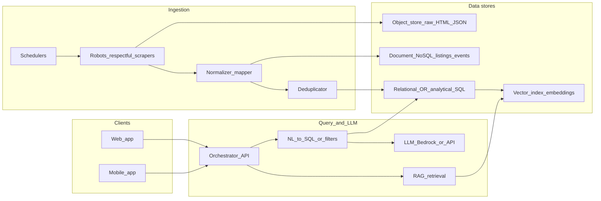

# CarPapi — system design and implementation map

## 1. Project summary

CarPapi is a ChatGPT-like **car search** application. Users ask in natural language; the system returns **accurate listing results** plus a **natural-language explanation** (not inventory fabricated by the model).

Example intents:

- “Find me a Toyota Camry under $25k near New Jersey”
- “Show SUVs with low mileage and monthly payment below $500”
- “Which cars are best value based on year, mileage, and price?”
- “Compare Honda CR-V and Toyota RAV4 listings”

**Core pipeline:** collect listings from multiple sites → clean and normalize → deduplicate → persist in databases/indexes → chat UI → **LLM query planner** translates intent into **structured search** (SQL or search DSL) → rank → respond with **cited listings** (IDs/URLs) and prose.

**Recommended retrieval pattern:** **RAG + structured retrieval** on a **canonical schema**. The LLM proposes **parameters or a constrained query plan**; a **validator/executor** runs **prepared statements** or an approved query builder—inventory truth stays in the database, not in model weights.

---

## 2. High-level flow (text diagram)

```text
Car Websites
   ↓
Scraper Workers
   ↓
Raw Data Storage
   ↓
Cleaning + Normalization
   ↓
Deduplication
   ↓
Structured Database + Search Index + Vector Store
   ↓
Backend API
   ↓
LLM Query Planner
   ↓
SQL / Search Query (validated)
   ↓
Ranked Car Results
   ↓
Web or Mobile Chat UI
```

**Response shape:** each answer should include (1) **ranked listing cards** or rows with stable IDs and source URLs, (2) **short rationale** tied to filters used, (3) optional **comparison table** when the user asks to compare models.

---

## 3. Reference architecture (diagram)



### 3.1 Layer responsibilities

| Layer | Role |
|-------|------|
| **Scrape** | Fetch pages/APIs; throttle; rotate; legal/compliance; store **raw** artifacts immutably. |
| **Normalize** | Map each source to **your canonical car schema** (make, model, trim, year, price, mileage, VIN/hash, URL, seller, geo, timestamps). |
| **Dedupe** | Keys: VIN when present; else fuzzy keys (make, model, year, price band, mileage band, location + **simhash/minhash** on title/description). Merge or **survivorship** rules (newest wins, or highest confidence source). |
| **Stores** | Raw in **object storage**; operational listings in **NoSQL or SQL**; embeddings in **vector DB**; optional **warehouse** for BI. |
| **Query** | LLM produces **structured constraints** + optional vector search; executor runs **validated** queries only (no arbitrary SQL strings from the model). |
| **UI** | Same **BFF/API** for web and mobile. |

---

## 4. Which models to use

**Do not rely on a single “fine-tuned GPT” for inventory truth**—listings change daily; the **database** is the source of truth.

1. **Embeddings (required for semantic search / RAG)**  
   - **AWS:** Amazon Titan Embeddings or **Cohere Embed v3** via Amazon Bedrock (fits VPC, IAM, billing).  
   - **Alternative:** OpenAI `text-embedding-3-*` if you accept external API and define data policy.

2. **Chat / orchestration LLM (NL → structured query + explanation)**  
   - **AWS-first:** Claude 3.5 Sonnet / Haiku or Llama 3.x via **Bedrock** (streaming, enterprise controls).  
   - **Alternative APIs:** OpenAI GPT-4.x for strong tool-use if not Bedrock-locked.

3. **Fine-tuning vs RAG (practical recommendation)**  
   - **Fine-tuning:** Use for **stable** behaviors—tone, dealership jargon, **JSON schema adherence**, formatting—not for memorizing listings.  
   - **RAG:** Primary mechanism for answering “find me X under $Y near Z” using **fresh** data.  
   - **Optional small specialist:** A **fine-tuned small model** (or LoRA) that only outputs **JSON** matching your `CarQuery` schema can reduce errors and cost; combine with a larger model for nuanced chat if needed.

4. **“Language SQL” implementation**  
   - Maintain a **fixed schema** in Postgres (or Aurora Serverless v2) with **read-only** DB user for the app.  
   - LLM outputs **parameters** for **prepared statements** or a **query builder** (safest).  
   - If you prefer full **text-to-SQL**, add a **lint/validate** step (allowed tables/columns only) and **dry-run** with row limits.

---

## 5. AWS vs local / network layout

### Production (typical AWS)

- **Ingestion:** **EventBridge** (cron) + **ECS Fargate** or **Lambda** (for short jobs) workers; **SQS** for queues; **S3** for raw dumps.  
- **API:** **API Gateway** + **ECS/Lambda** (container if heavy).  
- **Auth:** **Cognito** (optional) for mobile/web.  
- **Data:** See [STACK_DECISION.md](STACK_DECISION.md).  
- **LLM:** **Bedrock** in the **same region** as data (latency, compliance).  
- **Observability:** **CloudWatch** + **X-Ray**; optional **Grafana Cloud** if you want unified dashboards.

### Local / dev

- **Docker Compose:** Postgres (+ pgvector), LocalStack (optional), MinIO (S3-ish), Redis.  
- **Scrapers:** Run locally with **Playwright**/**Scrapy** against cached fixtures in CI—avoid hammering real sites from CI.  
- **No mandatory local LLM** for MVP; optional **Ollama** (Llama 3, Mistral) for offline dev to save API cost.

### Network

- **VPC** with private subnets for workers + DB; NAT for outbound scrape only if required; **security groups** least-privilege.  
- **Do not** expose scrapers or DB publicly; only API edge public.

---

## 6. Paid subscription: Claude vs Codex (Cursor)

This is **developer tooling for building CarPapi**, not the runtime LLM for users.

- **Claude (Cursor):** Strong for **architecture, long-context refactors, ambiguous specs**, and multi-file reasoning—fits **system design + backend + data pipelines**.  
- **Codex-style / GPT-heavy flows:** Often excellent for **short, dense code edits** and boilerplate at speed.  
- **Practical advice:** For this project’s mix (**scraping, dedupe, SQL schema, AWS glue**), **Claude-first** is a sensible default; many teams use **both** by switching models per task. Runtime costs for **Bedrock/OpenAI** are separate from Cursor subscription—budget those independently.

---

## 7. Do you need local models?

- **MVP / production:** **No**—cloud LLM + embeddings are enough.  
- **Use local models when:** strict **air-gap**, **cost control** at huge volume, or **sub-millisecond** embedding batches on-prem.  
- **Risk:** operational burden (GPUs, updates, eval). Defer until traffic or policy demands it.

---

## 8. Daily monitoring of scrapes

Treat scraping as a **data pipeline** with SLAs, not a cron script.

1. **Scheduling:** **EventBridge** rules per source (staggered), with **concurrency caps**.  
2. **Per-run metrics:** records fetched, normalized, deduped, rejected, error rate, latency, HTTP status distribution.  
3. **Data quality checks:** null rate on price/VIN fields, sudden price drops, duplicate spikes.  
4. **Alerting:** CloudWatch alarms → SNS/Slack/PagerDuty on **zero records**, **error rate > threshold**, or **schema drift** (new HTML layout).  
5. **Audit:** Keep **S3 raw** + **lineage** (source URL, scrape version, extractor version).  
6. **Dashboard:** Daily job status table + 7-day trend (Grafana or CloudWatch dashboard).

---

## 9. Repository layout (this folder)

- `architecture.md` — this document.  
- `schema/` — canonical JSON Schema + dedupe notes.  
- `runbooks/` — operational playbooks.  
- `STACK_DECISION.md` — Aurora + pgvector vs OpenSearch.  
- `pipeline/` — ingestion code (scrape → raw → normalize → dedupe → DB).  
- `services/api/` — BFF / orchestrator API.  
- `web/` — chat UI stub (streams from API).  

---

## 10. Risk and compliance (short)

- **Robots.txt / ToS:** Many listing sites prohibit scraping; prefer **official feeds/APIs**, partnerships, or **licensed data**. Architecture above assumes **lawful** sources.  
- **PII:** Minimize; encrypt at rest (KMS); retention policy on raw HTML.

---

## 11. Suggested phased delivery

1. **Phase A:** Canonical schema + one source + dedupe + Postgres + simple REST search (no LLM).  
2. **Phase B:** Embeddings + RAG + Bedrock chat with **structured query tool**.  
3. **Phase C:** Mobile app consuming same API; hardening; cost/latency tuning.  
4. **Phase D:** Optional fine-tune for **JSON query formatting** only; expand sources.
