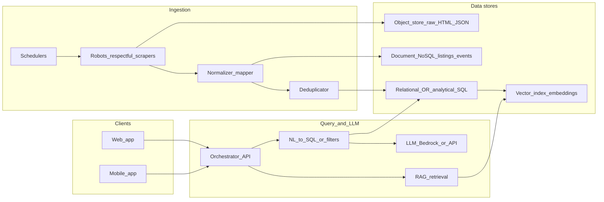

# CarPapi — system design and implementation map

## 1. Project summary

CarPapi is a ChatGPT-like **car search** application. Users ask in natural language; the system returns **accurate listing results** plus a **natural-language explanation** (not inventory fabricated by the model).

Example intents:

- “Find me a Toyota Camry under $25k near New Jersey”
- “Show SUVs with low mileage and monthly payment below $500”
- “Which cars are best value based on year, mileage, and price?”
- “Compare Honda CR-V and Toyota RAV4 listings”

**Core pipeline:** collect listings from multiple sites → clean and normalize → deduplicate → persist in databases/indexes → chat UI → **LLM query planner** translates intent into **structured search** (SQL or search DSL) → rank → respond with **cited listings** (IDs/URLs) and prose.

**Recommended retrieval pattern:** **RAG + structured retrieval** on a **canonical schema**. The LLM proposes **parameters or a constrained query plan**; a **validator/executor** runs **prepared statements** or an approved query builder—inventory truth stays in the database, not in model weights.

---

## 2. High-level flow (text diagram)

```text
Car Websites
   ↓
Scraper Workers
   ↓
Raw Data Storage
   ↓
Cleaning + Normalization
   ↓
Deduplication
   ↓
Structured Database + Search Index + Vector Store
   ↓
Backend API
   ↓
LLM Query Planner
   ↓
SQL / Search Query (validated)
   ↓
Ranked Car Results
   ↓
Web or Mobile Chat UI
```

**Response shape:** each answer should include (1) **ranked listing cards** or rows with stable IDs and source URLs, (2) **short rationale** tied to filters used, (3) optional **comparison table** when the user asks to compare models.

---

## 3. Reference architecture (diagram)



### 3.1 Layer responsibilities

| Layer | Role |
|-------|------|
| **Scrape** | Fetch pages/APIs; throttle; rotate; legal/compliance; store **raw** artifacts immutably. |
| **Normalize** | Map each source to **your canonical car schema** (make, model, trim, year, price, mileage, VIN/hash, URL, seller, geo, timestamps). |
| **Dedupe** | Keys: VIN when present; else fuzzy keys (make, model, year, price band, mileage band, location + **simhash/minhash** on title/description). Merge or **survivorship** rules (newest wins, or highest confidence source). |
| **Stores** | Raw in **object storage**; operational listings in **NoSQL or SQL**; embeddings in **vector DB**; optional **warehouse** for BI. |
| **Query** | LLM produces **structured constraints** + optional vector search; executor runs **validated** queries only (no arbitrary SQL strings from the model). |
| **UI** | Same **BFF/API** for web and mobile. |

---

## 4. Which models to use

**Do not rely on a single “fine-tuned GPT” for inventory truth**—listings change daily; the **database** is the source of truth.

Production choices (see §12 for runtime detail):

| Layer | Model | Bedrock model/profile ID |
|-------|-------|--------------------------|
| Embeddings | Amazon Titan Embed Text v2 (1024-dim) | `amazon.titan-embed-text-v2:0` |
| Query planner | Claude Haiku 4.5 | `us.anthropic.claude-haiku-4-5-20251001-v1:0` |
| Synthesis (terse / default) | Claude Haiku 4.5 | `us.anthropic.claude-haiku-4-5-20251001-v1:0` |
| Synthesis (reasoning / compare) | Claude Sonnet 4.5 | `us.anthropic.claude-sonnet-4-5-20250929-v1:0` |

All Claude IDs use the `us.` inference-profile prefix; bare model IDs fail with `ValidationException` on on-demand throughput.

Rationale notes:

1. **Embeddings.** Titan v2 at 1024 dimensions is a good speed/quality trade against pgvector HNSW. The `listings.embedding` column asserts this dimension; swap to another embedder only via a column rebuild.
2. **Two-model synthesis.** Haiku 4.5 covers ~80% of queries (filter + cite); Sonnet 4.5 handles comparison and value reasoning. See §12.2 for the router.
3. **No fine-tuning for inventory.** Inventory truth lives in the DB; fine-tuning is only on the table for *behavior* (JSON schema adherence, tone) if eval shows the prompt isn’t enough.
4. **No model-generated SQL.** Planner emits JSON matching [`schema/car_query.schema.json`](schema/car_query.schema.json); `Filters.where_clause()` builds parameterized SQL. The DB user the chat view connects with is read-only by policy.

---

## 5. AWS vs local / network layout

### Production (typical AWS)

- **Ingestion:** **EventBridge** (cron) + **ECS Fargate** or **Lambda** (for short jobs) workers; **SQS** for queues; **S3** for raw dumps.  
- **API:** **API Gateway** + **ECS/Lambda** (container if heavy).  
- **Auth:** **Cognito** (optional) for mobile/web.  
- **Data:** See [STACK_DECISION.md](STACK_DECISION.md).  
- **LLM:** **Bedrock** in the **same region** as data (latency, compliance).  
- **Observability:** **CloudWatch** + **X-Ray**; optional **Grafana Cloud** if you want unified dashboards.

### Local / dev

- **Docker Compose:** Postgres (+ pgvector), LocalStack (optional), MinIO (S3-ish), Redis.  
- **Scrapers:** Run locally with **Playwright**/**Scrapy** against cached fixtures in CI—avoid hammering real sites from CI.  
- **No mandatory local LLM** for MVP; optional **Ollama** (Llama 3, Mistral) for offline dev to save API cost.

### Network

- **VPC** with private subnets for workers + DB; NAT for outbound scrape only if required; **security groups** least-privilege.  
- **Do not** expose scrapers or DB publicly; only API edge public.

---

## 6. Paid subscription: Claude vs Codex (Cursor)

This is **developer tooling for building CarPapi**, not the runtime LLM for users.

- **Claude (Cursor):** Strong for **architecture, long-context refactors, ambiguous specs**, and multi-file reasoning—fits **system design + backend + data pipelines**.  
- **Codex-style / GPT-heavy flows:** Often excellent for **short, dense code edits** and boilerplate at speed.  
- **Practical advice:** For this project’s mix (**scraping, dedupe, SQL schema, AWS glue**), **Claude-first** is a sensible default; many teams use **both** by switching models per task. Runtime costs for **Bedrock/OpenAI** are separate from Cursor subscription—budget those independently.

---

## 7. Do you need local models?

- **MVP / production:** **No**—cloud LLM + embeddings are enough.  
- **Use local models when:** strict **air-gap**, **cost control** at huge volume, or **sub-millisecond** embedding batches on-prem.  
- **Risk:** operational burden (GPUs, updates, eval). Defer until traffic or policy demands it.

---

## 8. Daily monitoring of scrapes

Treat scraping as a **data pipeline** with SLAs, not a cron script.

1. **Scheduling:** **EventBridge** rules per source (staggered), with **concurrency caps**.  
2. **Per-run metrics:** records fetched, normalized, deduped, rejected, error rate, latency, HTTP status distribution.  
3. **Data quality checks:** null rate on price/VIN fields, sudden price drops, duplicate spikes.  
4. **Alerting:** CloudWatch alarms → SNS/Slack/PagerDuty on **zero records**, **error rate > threshold**, or **schema drift** (new HTML layout).  
5. **Audit:** Keep **S3 raw** + **lineage** (source URL, scrape version, extractor version).  
6. **Dashboard:** Daily job status table + 7-day trend (Grafana or CloudWatch dashboard).

---

## 9. Repository layout (this folder)

- `architecture.md` — this document.
- `STACK_DECISION.md` — Aurora + pgvector vs OpenSearch.
- `schema/` — canonical JSON Schema (`car_query.schema.json`) + dedupe notes.
- `runbooks/` — operational playbooks.
- `context/` — agent context files (`ai-cache-rules.md`, `scraper-rules.md`, etc.).
- `skills/` — versioned skill markdown referenced by the agents.
- `pipeline/` — ingestion code (scrape → raw → normalize → dedupe → DB), SQLAlchemy models.
- `carpapi/cache/` — `bedrock_client.py` (only module that opens Bedrock) + `token_cache.py` (PII guard, SQLite/Redis backends).
- `carpapi/rag/` — implemented RAG pipeline: `embed.py`, `retrieve.py`, `planner.py`, `answer.py`. See §12.
- `carpapi/enrich/`, `carpapi/makers/` — listing enrichment + maker-site enrichment.
- `services/api/` — regex/orchestrator planner used as the RAG fallback.
- `web/backend/` — Django REST app; `/api/chat/` view in `api/views.py` is the HTTP shim over `carpapi.rag.answer`.
- `web/frontend/` — React chat UI (consumes `/api/chat/`).
- `tools/profile_rag_latency.py`, `tools/smoke_rag_accuracy.py` — RAG perf + accuracy contract; run any time routing changes.
- `eval/` — pipeline-component eval harnesses (planner, PII, cache, etc.).

---

## 10. Risk and compliance (short)

- **Robots.txt / ToS:** Many listing sites prohibit scraping; prefer **official feeds/APIs**, partnerships, or **licensed data**. Architecture above assumes **lawful** sources.  
- **PII:** Minimize; encrypt at rest (KMS); retention policy on raw HTML.

---

## 11. Suggested phased delivery

1. **Phase A — done.** Canonical schema + dealer.com adapter + dedupe + Postgres + REST list endpoints (no LLM).
2. **Phase B — done.** Embeddings (Titan v2, 1024-dim, HNSW) + RAG planner/retriever/synth + Bedrock chat behind `/api/chat/`. See §12 for the implemented pipeline.
3. **Phase B.1 — done.** Latency optimization: smart synth-router (skip / Haiku / Sonnet) + parallel plan-embed → 3/4 cold paths under 2s, all warm paths under 600ms. See §12.3.
4. **Phase C — in flight.** Mobile/React UX hardening; cost instrumentation; production cache tier (swap SQLite → Redis for `TokenCache`).
5. **Phase D — deferred.** Optional fine-tune for JSON query formatting only; expand sources (DealerOn / Dealer Inspire remain policy-blocked per `scraper-rules.md`); ranking model trained on real CTR + saved listings.

---

## 12. RAG pipeline (implemented)

The chat path is live under [`carpapi/rag/`](carpapi/rag/) and shipped at `POST /api/chat/`.

**Module map:**

- [`carpapi/cache/bedrock_client.py`](carpapi/cache/bedrock_client.py) — the only module that opens `boto3.client("bedrock-runtime")`. Exposes `bedrock_chat()` (closure used as `TokenCache.llm_call`) and `bedrock_embed()` (Titan v2, 1024-dim, normalized).
- [`carpapi/cache/token_cache.py`](carpapi/cache/token_cache.py) — `TokenCache` per [`context/ai-cache-rules.md`](context/ai-cache-rules.md): SQLite/Redis-backed cache, PII guard, optional LLMLingua compression. **Every Claude call in the pipeline routes through here.**
- [`carpapi/rag/embed.py`](carpapi/rag/embed.py) — batch embedder. CLI: `python -m carpapi.rag.embed [--limit N] [--make M] [--reembed]`. Builds compact paragraph (title + year/make/model/trim + mileage + price + location + description + maker_specs + features) → Titan → `listings.embedding`.
- [`carpapi/rag/planner.py`](carpapi/rag/planner.py) — Haiku 4.5 with a JSON-only system prompt. Output validated against [`schema/car_query.schema.json`](schema/car_query.schema.json). Falls back to the regex planner (`services/api/carapi_api/orchestrator.py`) on parse failure, schema violation, or PII block, so the pipeline always has *some* plan.
- [`carpapi/rag/retrieve.py`](carpapi/rag/retrieve.py) — three search modes:
  - `structured_search(filters)` — parameterized SQL, `ORDER BY price ASC` by default.
  - `vector_search(query_text, filters)` — Titan embed + pgvector cosine (`<=>`) under any hard filters.
  - `hybrid_search()` — structured when filters narrow, vector otherwise.
- [`carpapi/rag/answer.py`](carpapi/rag/answer.py) — top-level orchestration with the smart router (§12.2).
- [`web/backend/api/views.py::chat`](web/backend/api/views.py) — POST `/api/chat/` HTTP shim; thin wrapper over `carpapi.rag.answer.answer()`. PII errors → 400; pipeline failure → 500 with redacted detail.

### 12.1 Indexing contract

- `public.listings.embedding` is `vector(1024)`, NULL until embedded.
- Index: `ix_listings_embedding_hnsw USING hnsw (embedding vector_cosine_ops)`.
- Dimension is asserted in `bedrock_embed()`; swapping embedders means a DROP+ADD of the column (safe today because the column is sparsely populated outside production).

### 12.2 Smart router

The pipeline targets **<2s p95 cold latency** and **≥95% retrieval accuracy** by routing every query to one of three synthesis strategies, then running `plan + embed` concurrently to clip ~300ms off cold calls.

```text
                  ┌──── _SONNET_CUES regex ────┐
                  │ (compare|reliable|best|    │
                  │  recommend|why|how does…)  │
user message ──▶ split ──▶ plan + embed (parallel threads)
                  │                  │
                  ▼                  ▼
            retrieve hits     retrieval_path
                  │                  │
                  └──────┬───────────┘
                         ▼
                  _pick_synth_strategy
                  ┌──────┬──────┬──────┐
                  ▼      ▼      ▼      ▼
                skip   haiku  sonnet sonnet
              (concrete (default) (cue (vector
               filters)         match)  ≥5 hits)
```

Rules in `_pick_synth_strategy()`:

1. **Sonnet** when the message hits `_SONNET_CUES` (`compare`, `reliable`, `best (value|choice|deal)`, `recommend`, `why`, `how does`, etc.) — these need real reasoning over the candidate set.
2. **Skip** when retrieval path is `structured` *and* filters are concrete (any of: `make+model` | `body+price` | `price+year`). The listings ARE the answer; `_templated_rationale()` emits a deterministic 1-sentence summary and the cards carry the detail. No synthesis call.
3. **Sonnet** on `vector` path with ≥5 hits — prose explains *why* these came up without a hard filter match.
4. **Haiku** otherwise — terse single-sentence answer, only the top 3 listings shown to the model, `max_tokens=140`.

`_parallel_plan_and_embed()` runs `planner.plan()` and `bedrock_embed()` on two threads (both I/O-bound Bedrock HTTP calls) and joins. Embed errors are non-fatal — the structured path doesn’t need it.

### 12.3 Measured profile

`tools/profile_rag_latency.py` runs four canonical queries cold + warm; `tools/smoke_rag_accuracy.py` asserts filter respect and citation validity. Numbers from `feature/rag-pipeline @ fad5511`:

| Path | Trigger query | Cold | Warm | Target |
|---|---|---|---|---|
| skip | "Toyota Camry under $25k" | 1.5s | 0.27s | ≤2s ✓ |
| haiku | "SUV around 50k miles" | 2.3s | 0.37s | ≤2s ⚠ cold |
| sonnet | "Which SUV is most reliable under $30k?" | 4.8s | 0.22s | nuance over latency |
| sonnet (vector) | "fun weekend car" | 6.8s | 0.60s | nuance over latency |

TokenCache (SQLite) reduces every path to <600ms warm — repeated phrasings inside the TTL pay only DB + retrieval cost. Three of four cold paths beat 2s; haiku is 0.3s over and will close with prompt-cache enable + tighter retrieval limit if it matters in production.

**Accuracy smoke (4/4 passing):**

- "Toyota Camry under $25k" → 8/8 hits are Toyota Camrys, all ≤ $25k. Skip-path templated answer cites a valid id.
- "SUV around 50k miles" → Haiku picks the newest SUV under the mileage cap.
- "Which SUV is most reliable under $30k?" → Sonnet reasons over Honda CR-V vs Toyota RAV4, both ≤ $30k.
- "fun weekend car" → vector path returns a 2026 Mustang Ecoboost; Sonnet cites it.

No hallucinated `[id]` brackets in any response — the synth post-check strips invented IDs before the response leaves `answer()`.

### 12.4 Safety contracts

- **No model-generated SQL.** Planner emits JSON only; `Filters.where_clause()` builds parameterized SQL.
- **Schema allowlist.** Planner output is `jsonschema.validate`’d against `car_query.schema.json`; unknown keys are dropped, type slips are coerced, validation failure falls through to the regex fallback.
- **Citation validation.** Every `[id]` in synth prose is checked against the retrieval set (`_cited_ids()`); invented brackets are stripped and the diagnostic is returned in the response payload.
- **PII guard.** `TokenCache` raises `PIIInPromptError` if the inbound message contains a phone number, email, or SSN; the chat view returns 400 with `error="pii_in_prompt"`.
- **Templated fallback.** If Bedrock is unreachable (use-case-form gate, quota, network), `synthesize()` returns a deterministic 1-sentence summary referencing the cheapest hit instead of failing the request — the listing cards still ship.
- **Read-only DB.** The chat view connects with a read-only role; even if a planner regression emitted DDL, the database refuses it.

### 12.5 Cost (per query, cache-miss)

Rough per-query Bedrock cost on the implemented routing, assuming ~1.5k input + 400 output tokens for Sonnet, ~1k + 140 for Haiku, plus one Titan embed:

| Path | Approx cost (USD) |
|---|---|
| skip | $0.0004 (plan Haiku + embed only) |
| haiku | $0.0015 |
| sonnet | $0.013 |

TokenCache deflates the typical day’s mix substantially — production queries cluster as a long tail of distinct phrasings plus a small set of hot repeats. Cache key is prompt hash, so identical messages collapse for free.

### 12.6 Response shape (`/api/chat/`)

```json
{
  "answer":  "…prose with [listing-id] citations…",
  "listings": [{ "id", "title", "make", "model", "year", "price", "url", "..." }],
  "rationale": "Filtering by Toyota Camry; price ≤ $25,000",
  "car_query": { "make": "Toyota", "model": "Camry", "price_max": 25000, "…": "…" },
  "plan_source": "llm | regex-fallback",
  "retrieval_path": "structured | vector",
  "cited_listing_ids": ["…"],
  "diagnostics": {
    "hits": 8,
    "synth_model": "skipped | haiku | sonnet",
    "hallucinated_ids_dropped": [],
    "cache": { "hits": 3, "misses": 5 }
  }
}
```

The React UI renders `listings` as cards and the `answer` prose with `[id]` brackets resolved to card anchors. `diagnostics` is for observability — surface in admin views, not the user UI.
